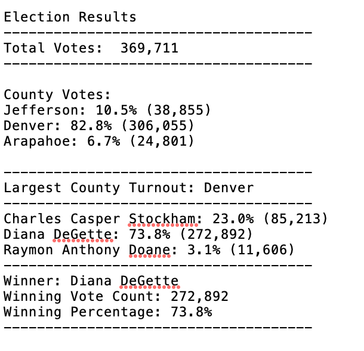

# ElectionResults_Analysis

## Overview:
  The goal of the project is to present the election result in a consolidated way. Provide the election results in a CSV format with Ballot ID, County, Candidate
  
  1. Calculate the total number of votes cast.
  2. List all the candidates who got the votes
  3. Calculate the number of votes each candidate got
  4. Calculate the percentage of votes each candidate got
  5. Find the winner with the number of votes they received and percentage of votes
  
## Prerequisite:
  Runtime: Python 3.7.6
  Editor: Any python editor preferred Visual Studio Code 1.40.1
  Source Data: election_results.csv with Ballot Id, County, Candidate columns copied to Resources directory
  
## Analysis:
  Analysis was done for the given Colorado local congressional election results data. 
  The total number of votes cast was 369,711. There were 3 candidates Charles Casper Stockham, Diana DeGette, Raymon Anthony Done who got the votes.
  
  Diana DeGette got 272,892 votes which are approximately 74% of the votes cast followed by Charles Casper Stockham who got 85,213 votes which is 23% of the votes cast while Raymon Anthony Doane got 11,606 votes which approx 3% of the votes cast.
  
  The winner is Diana DeGette who got the majority of the votes. Please see the snapshot of the result in a tabular form 
  
## Challenge Overview:
  Extend the election results code to get additional details about County wise voter turnout, percentage vote and also find the county which has largest voter turnout

## Challenge Summary:
  Based on the election data provided for Colorado local congressional election. Denver had the largest voter turnout with approx 83% followed by Jefferson which was close to 11% while Arapahoe has the lowest voter turnout of approx 7% 
